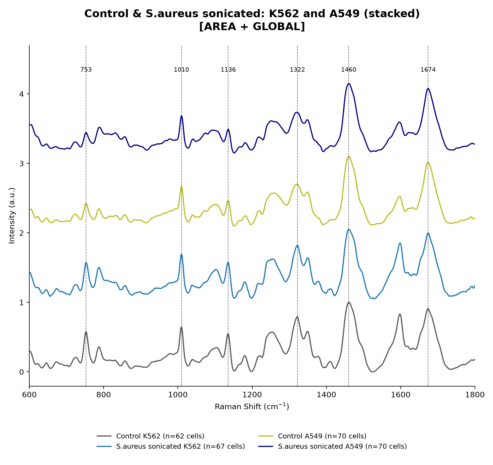
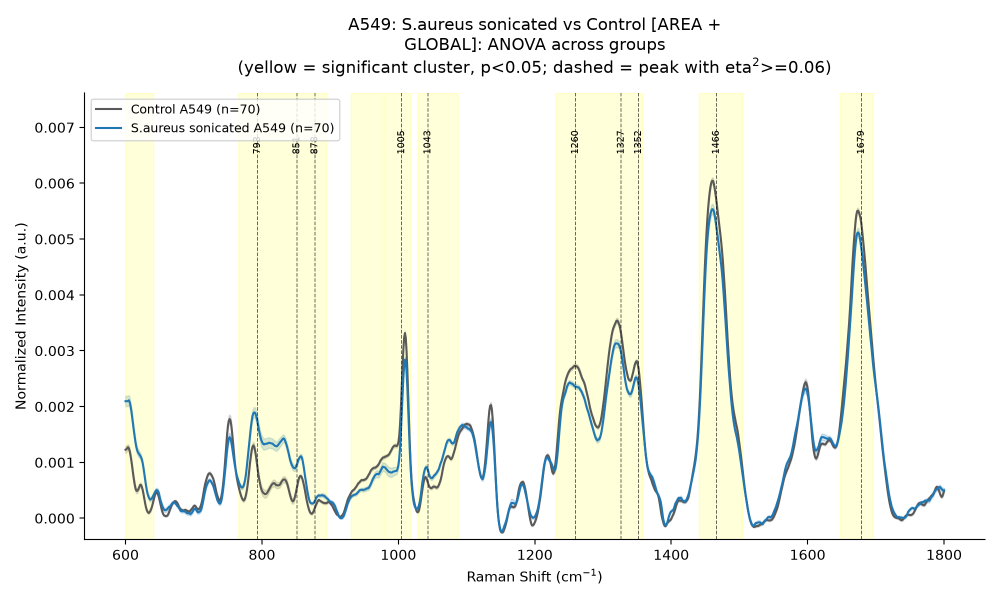
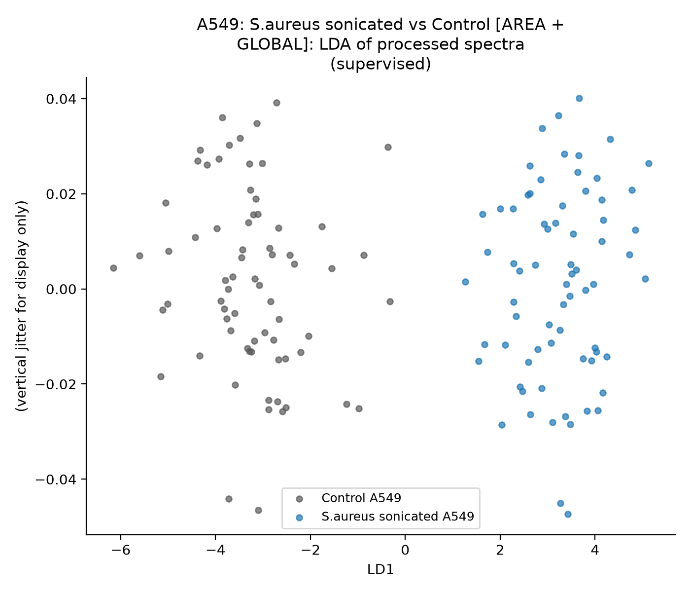
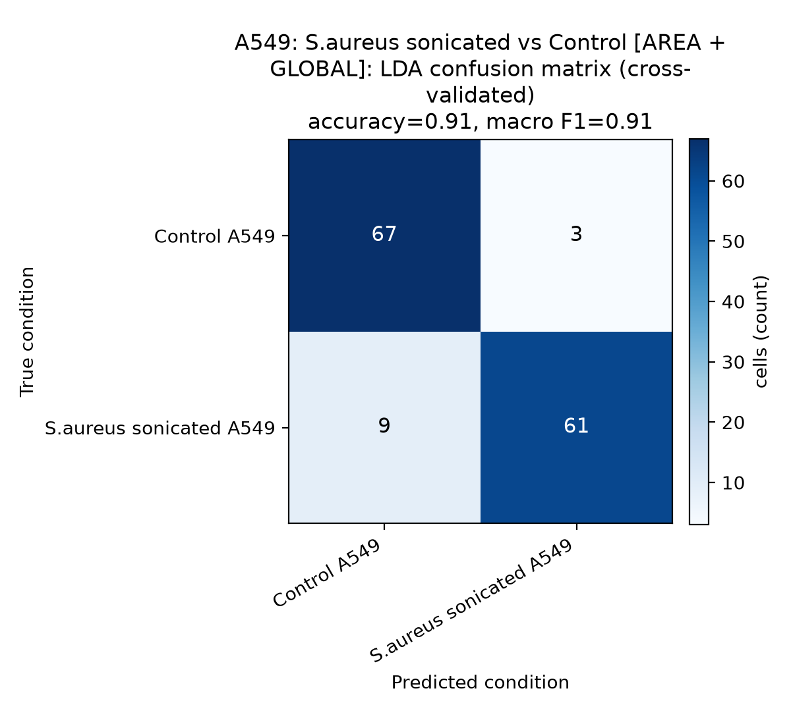

# Raman spectral analysis of cancer cells treated with bacterial secretome

In this project I analyse single-cell Raman spectra from two cancer cell lines, **A549** and **K562**.
The cells were treated with the secretome of ***E. coli*** and ***S. aureus***, prepared in two ways:
**heat-inactivated** and **sonicated**. The pipeline goes from raw spectra to preprocessing,
statistical comparison and ML-based classification of the treatment groups.

> The raw spectra and full results belong to ongoing lab work and are not shared here.
> A few example figures are shown below.

## Pipeline steps

| Step | File | What it does |
|---|---|---|
| 1 | `pipeline/preprocessing.py` | Read CSVs, cosmic spike removal, ROI 600–1800 cm⁻¹, Savitzky–Golay smoothing, ALS baseline correction, area / L2 normalization |
| 2 | `pipeline/shift_correction.py` | Raman shift correction: 1445 cm⁻¹ peak alignment or global shift against the Control mean |
| 3 | `pipeline/plotting.py` | Stacked replicate spectra (R1/R2/R3), stacked and overlapped group comparisons |
| 4 | `pipeline/anova.py` | Cluster-based permutation ANOVA, η² effect-size filter, Games–Howell post-hoc, peak bar charts |
| 5 | `pipeline/classification.py` | PCA, LDA, LDA confusion matrices (5-fold CV and leave-one-replicate-out CV) |
| 6 | `pipeline/peak_shift.py` | Peak position shifts between conditions (bootstrap) |
| 7 | `norm_shift_comparison.py` | Compares L2 vs area normalization × no shift / 1445 peak / global shift correction: runs the full analysis on all 6 versions and makes side-by-side comparison figures |

`main.py` runs all steps for one experiment. `stacked_K562_vs_A549.py` makes the combined K562 + A549
spectra plots. All settings are in `config.py`.

## How to run

```bash
pip install -r requirements.txt
```

In `config.py`, set `EXPERIMENT` to one of:
`A549_sonicated`, `A549_heat`, `K562_sonicated`, `K562_heat` → then run `python main.py`
`K562_vs_A549_sonicated`, `K562_vs_A549_heat` → then run `python stacked_K562_vs_A549.py`

For the normalization / shift-correction comparison, set `NORM_SHIFT_CELL_LINE` (`K562` or `A549`)
in `config.py` and run `python norm_shift_comparison.py`.

## Example figures

**Control and *S. aureus* sonicated, K562 and A549 (area normalization + global shift)**



| ANOVA (A549, *S. aureus* sonicated vs Control) | LDA |
|---|---|
|  |  |

**LDA confusion matrix (5-fold cross-validation)**



## Repository structure

```
config.py                  settings for every experiment
main.py                    full analysis (steps 1-6)
stacked_K562_vs_A549.py    K562 + A549 stacked / overlap plots
norm_shift_comparison.py   L2 / area x none / 1445 / global comparison
pipeline/
    preprocessing.py
    shift_correction.py
    plotting.py
    anova.py
    classification.py
    peak_shift.py
data/                      raw data goes here (not uploaded)
docs/figures/              figures used in this README
```

## Tools

Python, NumPy, SciPy, pandas, scikit-learn, statsmodels, matplotlib

## Author

Anukriti Jaya Sinha (B.Tech'27 IIT Roorkee). Contact: anukriti_js@bt.iitr.ac.in
